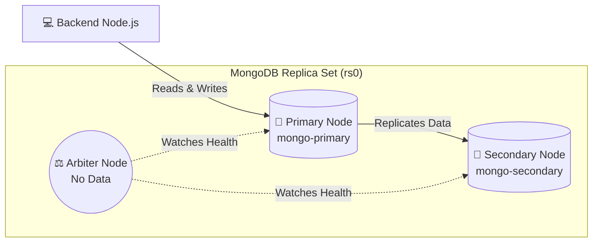
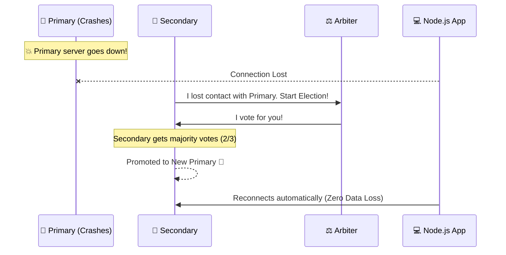
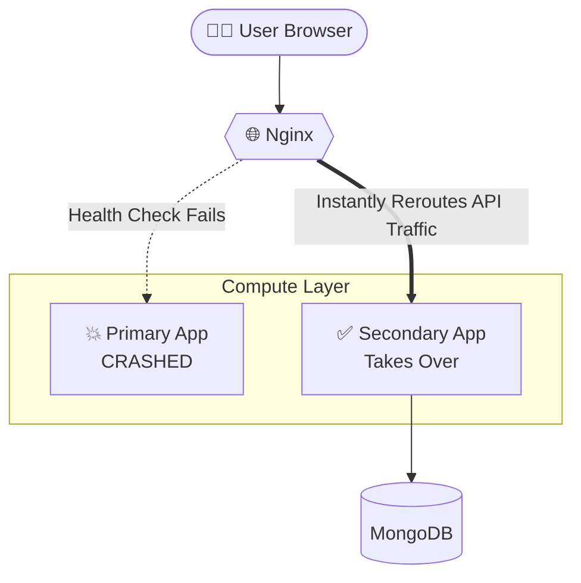
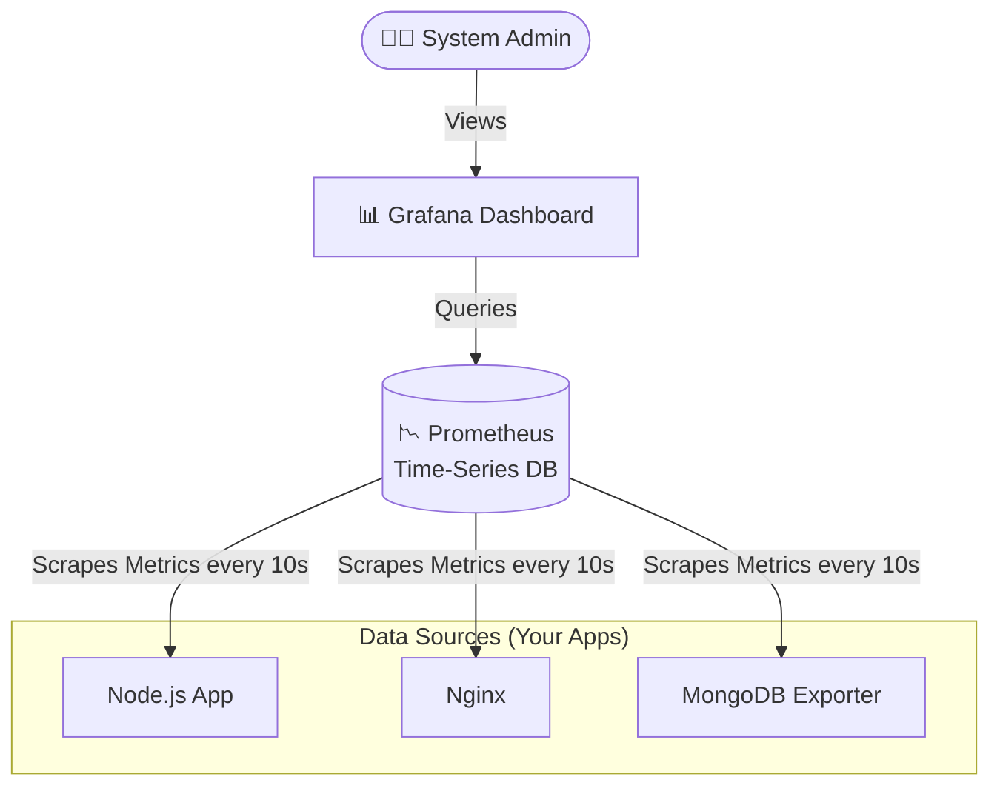

# 🏥 Visual Architecture & Disaster Recovery Breakdown

This document visually breaks down how traffic flows through your Healthcare Application and how the Disaster Recovery (DR) mechanisms automatically heal the system.

## 1. 🚦 End-to-End Traffic Flow

When a doctor or patient uses the application, the traffic flows through a central load balancer (Nginx). Nginx acts as an API Gateway, serving the React UI directly and routing data requests (`/api`) to the backend apps.

```mermaid
flowchart TD
    User([👨‍⚕️ User Browser]) -->|1. Gets UI (Port 8080)| Nginx{{🌐 Nginx API Gateway}}
    User -->|2. Calls /api| Nginx
    
    Nginx -->|Serves React Code| React[🖥️ Dockerized Frontend]

    subgraph "Simulated Multi-Region Compute"
        Nginx -->|Routes API Traffic| App1[💻 Primary App\nNode.js]
        Nginx -.->|Standby/Failover| App2[💻 Secondary App\nNode.js]
    end

    subgraph "High Availability Storage"
        App1 --> MongoPrimary[(🗄️ MongoDB Primary)]
        App2 --> MongoPrimary
        App1 --> MinioPrimary[📁 MinIO Primary\nFile Storage]
        App2 --> MinioPrimary
    end
```

---

## 2. 🗄️ Database Replication & Zero Data Loss

To prevent data loss if a server crashes, MongoDB is deployed as a **Replica Set**. All writes go to the Primary, which instantly copies the data to the Secondary.



---

## 3. 💥 Disaster Recovery: Database Failover (Election)

If the `mongo-primary` container is killed by the Chaos Monkey (or a real server crash), the Node.js app temporarily loses connection. Within milliseconds, the remaining nodes vote to promote the Secondary to be the new Primary.



---

## 4. 🔀 Disaster Recovery: Application Failover

If the entire Primary Region (the `primary-app` container) crashes, Nginx detects the failure via its health checks and instantly starts routing all backend API traffic to the `secondary-app`. The user never sees an error.



---

## 5. 📊 The Observability Stack (Metrics)

How do you know the DR is working? The observability stack constantly scrapes data from the containers and creates visual graphs.


